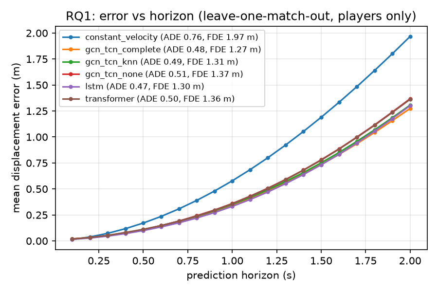
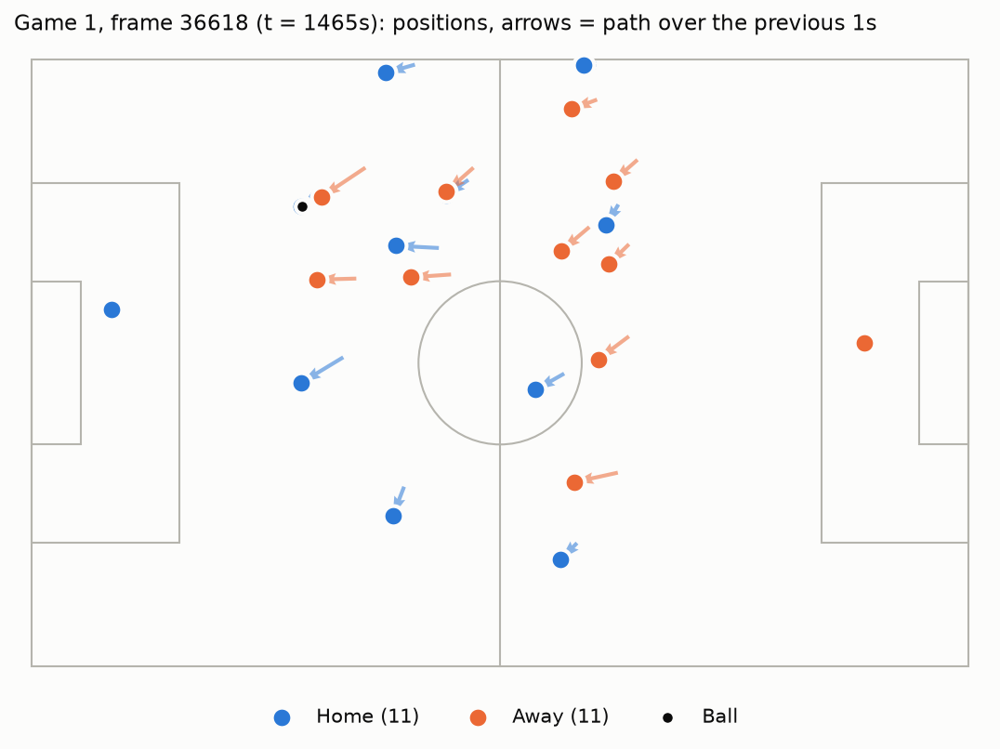

# football-analytics

**Spatio-temporal GNN trajectory prediction and space creation value for football tracking data**

> 시공간 그래프 신경망(ST-GNN)으로 축구 선수 22명의 궤적을 예측하고, 오프더볼 움직임이 만든 공간의 가치를 정량화하는 연구 (고려대학교 세종캠퍼스 S-CURT 2026-2)

## 개요

### 왜 이 연구를 하는가

축구에서 결정적인 기회는 공을 가진 선수 혼자 만들지 않는다. 한 선수가 수비수를 끌고 측면으로 빠지면서 동료에게 슈팅 공간을 열어주는 장면처럼, 득점이나 어시스트 기록에는 남지 않지만 기회를 만든 움직임이 경기마다 반복된다. 토마스 뮐러가 스스로를 '공간 해석자(Raumdeuter)'라 부르고, 피르미누가 최전방에서 내려오며 동료의 침투 공간을 열어준 역할이 높이 평가받은 것도 같은 맥락이다.

현대 축구에서는 수비 조직과 압박 전술이 발전하면서 1대1 돌파만으로 기회를 만들기가 점점 어려워지고 있다. 야말, 올리세, 비니시우스처럼 압도적인 드리블러는 여전히 가장 높은 평가를 받지만, 모든 선수에게 그런 능력을 기대할 수는 없다. 그만큼 공 없이 움직여 공간을 만들고 그 기회를 살리는 능력이 선수 평가에서 더 중요해지고 있다.

그러나 기존 지표는 대부분 슈팅, 패스, 드리블처럼 공을 가진 순간의 행동만 기록하므로 오프더볼 움직임의 가치를 담지 못한다. 본 연구는 선수 22명의 트래킹 데이터를 시공간 그래프로 표현해 선수의 '평범한' 움직임을 예측하는 모델을 만들고(RQ1), 실제 움직임을 이 예측으로 바꿔 넣는 가상 전술 시뮬레이션으로 그 선수가 만들어낸 공간의 가치를 정량화한다(RQ2).

### 연구 질문

- **RQ1 궤적 예측**: 과거 4초 동안의 선수 22명과 공의 좌표로 다음 2초의 위치를 예측한다. 선수 간 상호작용을 그래프(GCN + TCN)로 모델링하면 선수를 각각 따로 예측하는 모델보다 나은지 평균 변위 오차(ADE)와 최종 변위 오차(FDE)로 비교한다.
- **RQ2 공간 창출 가치**: 한 선수의 실제 궤적을 RQ1 모델이 예측한 평범한 궤적으로 바꿔 넣고, Pitch Control(어느 팀이 각 지점을 먼저 차지하는가)과 위치 가치(그 지점이 얼마나 위협적인가)의 곱이 얼마나 달라지는지 계산한다. 그 차이가 그 선수가 만든 공간의 가치이다.

RQ1의 예측 모델이 RQ2에서 "평범한 선수라면 이렇게 움직였을 것"이라는 비교 기준이 된다.

### 데이터와 파이프라인

Metrica Sports 공개 데이터 3경기(25Hz 트래킹 + 이벤트)를 사용한다. 좌표를 경기장 중앙 원점의 미터 단위로 바꾸고, 홈 팀이 항상 +x 방향으로 공격하도록 통일하며, 순간이동 오류를 제거한 뒤 10Hz로 재표본화해 SQLite DB에 적재한다. 이를 6초 조각(입력 4초 + 정답 2초, 23노드) 약 8,300개로 자르고, 한 경기를 통째로 시험용으로 빼는 경기 단위 교차검증(leave-one-match-out)으로 평가한다. 데이터는 선수와 팀이 익명이므로, 실명 선수 평가는 향후 다른 데이터로 확장할 과제이다.

### 지금까지의 결과 (RQ1)

시드 3개 평균 기준으로 같은 GCN-TCN에서 선수끼리 연결하면 2초 뒤 위치 오차(FDE)가 1.37m에서 1.28m로 줄었고, 시드 3개 × 경기 3개의 9개 조합 모두에서 그랬다. 선수 간 상호작용이 예측에 도움이 된다는 뜻이다. 완전 연결 GCN-TCN은 선수별 LSTM과 비슷한 성능을 파라미터 1/4로 낸다. 자세한 표는 아래 [Results](#results-so-far-rq1-2-s-horizon-players-only-leave-one-match-out)에 있다.

### 다음 단계

1. 패스 가능성 엣지로 그래프 구성, GCN-TCN 확장
2. Pitch Control(Spearman, 2018)과 위치 가치 그리드 구현
3. 가상 전술 시뮬레이션으로 공간 창출 가치 계산과 사례 분석

## Research questions

| | Question | Metric |
|---|---|---|
| **RQ1** | Given 4 s of all 22 players + ball, how well can we predict the next 2 s? Does modelling player interactions as a graph (GCN + TCN) beat per-player baselines? | ADE / FDE (m) |
| **RQ2** | How much space did a player's off-ball run create? Replace their real trajectory with the model's "typical" prediction (a virtual tactical simulation) and measure the change in pitch control weighted by location value. | Space Creation Value |

The RQ1 model doubles as the counterfactual baseline for RQ2.

## Pipeline

```
Metrica raw (25 Hz, normalized)  ->  metres, centre origin, y up
  -> home always attacks +x  ->  glitch removal (> 12 m/s)  ->  (optional smoothing, off)
  -> uniform 10 Hz resampling  ->  velocities
  -> SQLite (matches / players / frames / positions / events)
  -> 6 s windows (4 s in, 2 s out), 23 nodes (11 + 11 + ball)  ->  models
```

## Quick start

```bash
pip install -e '.[ml]'      # or: pip install -r requirements.txt  (drop [ml] for data only)
bash scripts/download_metrica.sh          # 3 open matches -> data/metrica
python scripts/build_db.py                # -> data/football.db (~170k frames, 3.8M positions)
python scripts/run_baselines.py           # RQ1 baselines
python scripts/train_baseline.py --model lstm         # per-player LSTM, leave-one-match-out (~25 min on Apple MPS)
python scripts/train_baseline.py --model transformer  # per-player Transformer (~45 min)
python scripts/train_baseline.py --model gcn_tcn --graph complete  # GCN-TCN; also knn / none (~25 min each)
python scripts/plot_horizon.py                        # error vs horizon figure from runs/
python scripts/summarize_seeds.py                      # mean ± std over seeds (runs/seeds/seed<k>/)
pytest                                    # synthetic-data tests, no download needed
```

## Results so far (RQ1, 2 s horizon, players only, leave-one-match-out)

ADE / FDE in metres per held-out match.

| Model | Interactions | metrica_1 | metrica_2 | metrica_3 | **mean** |
|---|---|---|---|---|---|
| Stationary | - | 2.26 / 4.22 | 2.29 / 4.28 | 2.33 / 4.36 | 2.29 / 4.29 |
| Constant velocity | - | 0.72 / 1.86 | 0.75 / 1.93 | 0.82 / 2.11 | 0.76 / 1.97 |
| Per-player LSTM | no | 0.43 / 1.19 | 0.45 / 1.24 | 0.55 / 1.48 | **0.47** / 1.30 |
| Per-player Transformer | no | 0.47 / 1.28 | 0.48 / 1.30 | 0.57 / 1.51 | 0.50 / 1.36 |
| GCN-TCN, no edges | no | 0.46 / 1.26 | 0.48 / 1.32 | 0.58 / 1.52 | 0.51 / 1.37 |
| GCN-TCN, kNN (k = 4) | yes | 0.44 / 1.21 | 0.46 / 1.24 | 0.56 / 1.47 | 0.49 / 1.31 |
| GCN-TCN, complete | yes | 0.43 / 1.17 | 0.45 / 1.22 | 0.55 / 1.44 | 0.48 / **1.27** |

Windows per match: 2,733 / 2,483 / 3,059. Learned models: `python scripts/train_baseline.py --model lstm|transformer|gcn_tcn [--graph none|knn|complete]`,
up to 80 epochs with early stopping. The table above is seed 0.

Mean ± std over seeds 0-2 (`--seed 1 --out-dir runs/seeds/seed1`, then `python scripts/summarize_seeds.py`):

| Model | ADE (m) | FDE (m) |
|---|---|---|
| Per-player LSTM | **0.474 ± 0.001** | 1.298 ± 0.003 |
| GCN-TCN, no edges | 0.509 ± 0.003 | 1.374 ± 0.007 |
| GCN-TCN, kNN (k = 4) | 0.491 ± 0.003 | 1.313 ± 0.007 |
| GCN-TCN, complete | 0.482 ± 0.004 | **1.284 ± 0.010** |

- **Interactions help.** Edges lower the error of the same GCN-TCN (complete vs none: ADE -0.027 m, FDE -0.090 m),
  far beyond the seed-to-seed spread (std <= 0.01 m), and in all 9 seed x held-out-match pairs. This is the RQ1 comparison.
- Against the per-player LSTM, the complete-graph GCN-TCN is on par: LSTM is slightly better on ADE, GCN-TCN on FDE
  (6 of 9 pairs), both within 0.02 m, with a quarter of the parameters (74k vs 287k).
- Swapping recurrence for attention (LSTM -> Transformer) does not help on 4 s histories.
- Smoothing is off: a centred 0.5 s moving average leaked future frames into the inputs and made the LSTM look better than it is (0.36 / 1.07 m).



## Data

[Metrica Sports sample data](https://github.com/metrica-sports/sample-data): 3 anonymized matches with synchronized tracking (25 Hz) and events. Data are downloaded, not committed. Findings from the exploratory analysis are in [docs/data.md](docs/data.md).



## Layout

```
src/stfootball/
  io/metrica.py   loaders for CSV (games 1-2) and FIFA EPTS (game 3, substitution-aware)
  preprocess.py   metres, direction, glitch removal, smoothing, 10 Hz resampling, velocity
  db.py           SQLite schema, loader, event-window queries
  windows.py      fixed-size 23-node sliding windows
  baselines.py    stationary, constant velocity
  graphs.py       per-step adjacency: none / complete / kNN
  models/         per-player LSTM and Transformer baselines, GCN-TCN
  train.py        training loop, train/val split with overlap gap
  metrics.py      ADE, FDE, error per horizon step
scripts/          download, build_db, run_baselines, train_baseline, plot_horizon, summarize_seeds
tests/            pipeline and model tests on synthetic data
docs/             data notes and figures
```

## Roadmap

- [x] Data loaders, cleaning, SQLite store, baselines
- [x] Per-player LSTM baseline
- [x] Transformer per-player baseline
- [x] Graph construction (complete / kNN) + GCN-TCN in PyTorch Geometric
- [x] Repeat GCN-TCN and LSTM over 3 seeds
- [ ] Pass-availability edges, larger GCN-TCN
- [ ] Pitch control (Spearman 2018) and location value
- [ ] Virtual tactical simulation and Space Creation Value
- [ ] Extension: graph Neural ODE for continuous-time trajectories

## Acknowledgements

Tracking and event data by [Metrica Sports](https://metrica-sports.com/). Advisor: 전진성 교수님 (Korea University Sejong).
