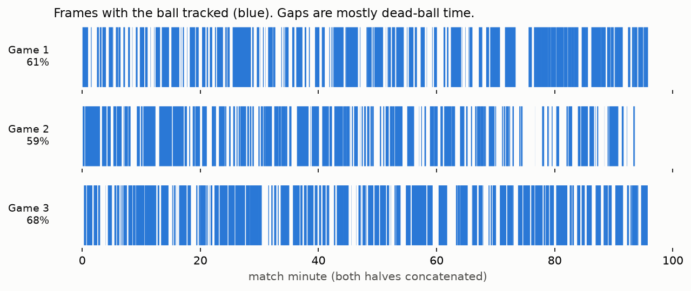

# Metrica sample data: what we found

Exploratory analysis of the 3 Metrica Sports open matches (2026-10-03).

| | Game 1 | Game 2 | Game 3 |
|---|---|---|---|
| Format | CSV (home/away files) | CSV | FIFA EPTS + JSON events |
| Frames (25 Hz) | 145,006 | 141,156 | 143,761 |
| Duration | 96.7 min | 94.1 min | 95.8 min |
| Player ids (incl. subs) | 14 / 14 | 14 / 12 | 17 / 18 |
| Frames with exactly 11 v 11 | 100% | 100% | 100% |
| Ball missing | 39.1% | 41.0% | 32.2% |
| Events / shots | 1,745 / 24 | 1,935 / 24 | 3,620 / 20 |

1. **Coordinates** are normalized to [0, 1] with the origin top-left (y down). We convert to metres with the origin at the centre spot and y up.
2. **No missing players**: every frame has 11 v 11, so each frame is a fixed 22-node graph (+ ball). Substitutes are NaN before/after they play, so node order is assigned per window (team, then position), not by player id.
3. **Game 3 slot mapping changes at substitutions**: the EPTS line has 22 slots whose player assignment differs per `DataFormatSpecification` frame range. The loader resolves it per frame.
4. **Ball gaps are dead-ball time**: one second after a BALL OUT event 94% of frames have no ball; at pass starts 0% do. Windows are cut only where the ball is tracked.
5. **Events and tracking are in sync**: pass start vs tracked ball, median 0.15-0.40 m.
6. **Tracking glitches** in games 1-2: short jumps of 13-60 m/s (raw max 557 m/s; ~0.02-0.06% of player-frames). A forward reachability gate (12 m/s) removes them, then gaps up to 1 s are interpolated.
7. **Attacking direction flips at half-time**; periods are rotated so home always attacks +x (events get the same rotation).
8. **Small data**: ~8,300 six-second windows at 1 s stride across 3 matches. Evaluate leave-one-match-out; overlapping windows make frame-level splits leak.
9. **Event definitions differ by format**: CARRY exists only in game 3 (1,395 events).
10. **Few shots** (20-24 per match): validating space value only against shots/goals is underpowered; more frequent outcomes (box entries, progressive passes) are needed.

